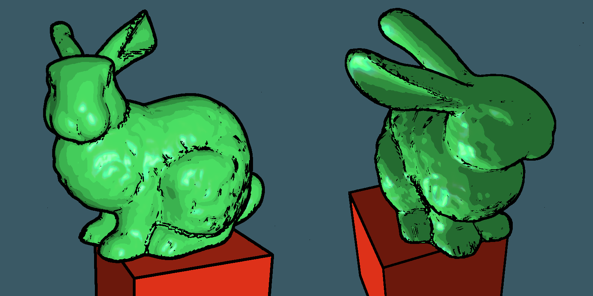

## Ethan Scheelk
### Macalester College, 1600 Grand Avenue, Saint Paul, MN
# NPRCartoonOutlines
**COMP465 Interactive Computer Graphics Final Project** -- Professor Bret Jackson. Spring 2023. 

The goal of this project was to implement cartoon graphics within OpenGL and C++. 
Primarily, this involved finding depth and normal maps, finding the edges of those maps, then combining those edges on to 
the final image. 

Techniques largely inspired by [Philippe Decaudlin](https://phildec.users.sourceforge.net/Research/Cartoon.php).

This repository includes an optional window preset to launch it in 1600x900. This project requires MinVR and BasicGraphics to compile. 

'A', 'S', and 'D' toggle ambient, specular, and diffuse lighting, respectively. Press 'F' to view the render pass stages. 

